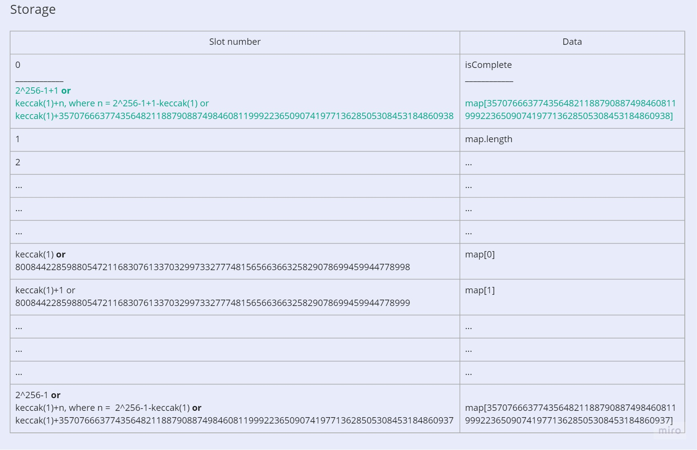

# Mapping
https://capturetheether.com/challenges/math/mapping/

1. Use MappingSolution.sol to get the map array index that writes to the isComplete variable at storage slot 0.*
2. Call the function "set" with the arguments ((found number at step 1), 1) to force the array to wrap around the max storage slot and make isComplete variable True.

*Explanation:
See https://docs.soliditylang.org/en/latest/internals/layout_in_storage.html.
Every contract has its own storage, which is actually a mapping of 2^256 * 32-bytes-slots.
The elements of the map array are of type uint256 which means that one element occupies an entire 32-bit slot.
So, the contract storage is look like:
